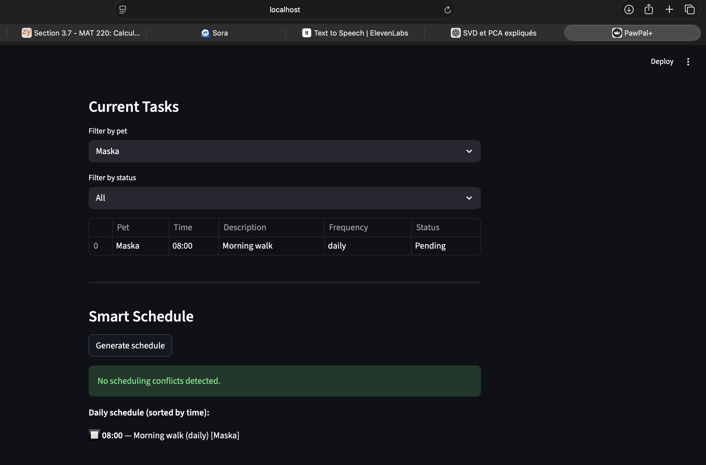
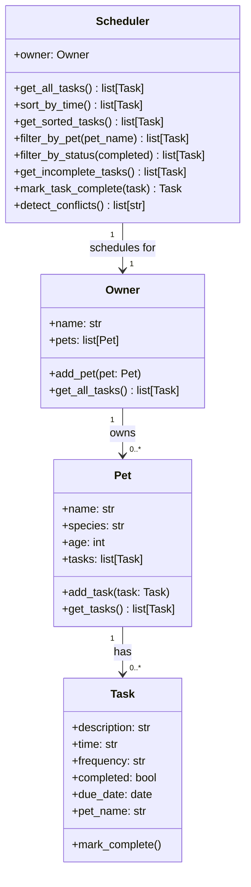

# PawPal+ (Module 2 Project)

You are building **PawPal+**, a Streamlit app that helps a pet owner plan care tasks for their pet.

## Scenario

A busy pet owner needs help staying consistent with pet care. They want an assistant that can:

- Track pet care tasks (walks, feeding, meds, enrichment, grooming, etc.)
- Consider constraints (time available, priority, owner preferences)
- Produce a daily plan and explain why it chose that plan

Your job is to design the system first (UML), then implement the logic in Python, then connect it to the Streamlit UI.

## What you will build

Your final app should:

- Let a user enter basic owner + pet info
- Let a user add/edit tasks (duration + priority at minimum)
- Generate a daily schedule/plan based on constraints and priorities
- Display the plan clearly (and ideally explain the reasoning)
- Include tests for the most important scheduling behaviors

## 📸 Demo

<a href="app_screenshot.png" target="_blank"></a>

## System Architecture

### Original design (Phase 1 UML)

The initial design had five classes: `Owner`, `Pet`, `Task`, `SchedulePlanner`, and `DailyPlan`. `SchedulePlanner` held its own flat task list and produced a `DailyPlan` object. `Task` modeled priority, duration, category, and a required flag — reflecting a constraint-based ranking approach.

### Final implementation (Phase 6 UML)



### Key design changes from original to final

| Aspect | Original design | Final implementation |
|---|---|---|
| Planner class | `SchedulePlanner` with its own task list | `Scheduler` delegates to `Owner.get_all_tasks()` — no duplicate state |
| Output object | `DailyPlan` (selected tasks + reasoning) | Plain sorted `list[Task]` — simpler and sufficient |
| Task fields | `priority`, `duration`, `category`, `required` | `time` (HH:MM), `frequency`, `due_date`, `pet_name` — time-first model |
| Scheduling model | Constraint-based ranking within a time budget | Chronological sort + conflict detection |
| Recurrence | Not modelled | `mark_task_complete()` auto-creates the next occurrence via `timedelta` |

## Smarter Scheduling

The `Scheduler` class now includes four algorithmic improvements beyond basic task listing:

- **Sorting** — `sort_by_time()` orders all tasks chronologically using Python's `sorted()` with a lambda key on the `HH:MM` time string. Zero-padded 24-hour format means lexicographic order equals chronological order, so no datetime parsing is needed.
- **Filtering** — `filter_by_pet(name)` returns only the tasks for a given pet; `filter_by_status(completed)` separates pending tasks from finished ones. Both use list comprehensions for a single-pass O(n) scan.
- **Recurring tasks** — `mark_task_complete(task)` marks a task done and automatically creates the next occurrence using Python's `timedelta`: `+1 day` for `"daily"` tasks and `+7 days` for `"weekly"` tasks. One-time (`"once"`) tasks are simply closed out.
- **Conflict detection** — `detect_conflicts()` groups all tasks by their time slot into a `defaultdict` and emits a warning string for every slot that contains more than one task. It catches exact double-bookings in O(n) time without crashing the program.

## Testing PawPal+

Run the automated test suite with:

```bash
python -m pytest
```

The suite (26 tests in `tests/test_pawpal.py`) covers:

| Area | What is verified |
|---|---|
| Task state | Completion flag flips correctly; pet name is stamped on add |
| Sorting | Tasks come back in chronological HH:MM order regardless of insertion order; no tasks are dropped or duplicated |
| Filtering | `filter_by_pet` is case-insensitive and returns an empty list for unknown names; `filter_by_status` correctly splits pending vs. completed tasks |
| Recurring tasks | Daily → next due date is +1 day; weekly → +7 days; one-time → returns `None`; new task goes to the right pet; original is marked done |
| Conflict detection | Same-time tasks are flagged; different-time tasks are clean; completed tasks are excluded from conflict checks; multiple conflict slots each produce a warning |
| Edge cases | Owner with no pets and pet with no tasks both return empty results safely |

**Confidence level: ★★★★☆
All happy paths and the most important edge cases are covered. The main gap is that conflict detection only checks exact time matches and does not model task duration, so a 30-minute overlap between adjacent tasks would go undetected.

## Getting started

### Setup

```bash
python -m venv .venv
source .venv/bin/activate  # Windows: .venv\Scripts\activate
pip install -r requirements.txt
```

### Suggested workflow

1. Read the scenario carefully and identify requirements and edge cases.
2. Draft a UML diagram (classes, attributes, methods, relationships).
3. Convert UML into Python class stubs (no logic yet).
4. Implement scheduling logic in small increments.
5. Add tests to verify key behaviors.
6. Connect your logic to the Streamlit UI in `app.py`.
7. Refine UML so it matches what you actually built.
